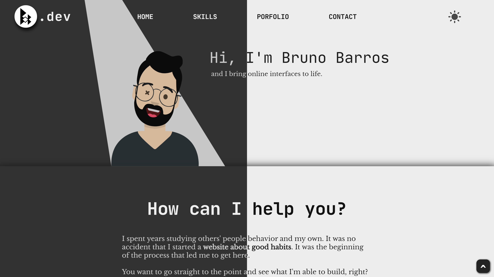

<p align="center">
  <a href="https://brunobarros.dev">
    
  </a>
</p>
<h3 align="center">👋 Hi! I'm Bruno Barros</h2>
<p align="center">A Web Developer</p>



*Obs: If you are using this site or any of it's components for your own portfolio site, I would be very grateful if you could give some credits to me in your footer*

## :rocket: Quick start

**Run the site locally with a recomended Node version above 18**

### Step 1: Clone The Repo

Fork the repository. then clone the repo locally by doing -

```bash
git clone https://github.com/bobarros/bruno-web.git
```

### Step 2: Install Dependencies

cd into the directory

```bash
cd bruno-app-router
```

install all the dependencies
```bash
yarn install
or
npm install
```

### Step 3: Start Development Server

Then start the development Server
```
yarn dev or npm run dev
```
After running the development server the site should be running on https://localhost:3000


## :open_file_folder: What's inside?

A quick look at the folder structure of this project.

    ├── app
    ├── components
         ├─── shared components or page name
    ├── content
         ├─── page name
    ├── public
         ├───fonts
         ├───img
         └───pdf
         └───svg
    ├── styles
         ├─── shared module styles
    └── svg
        ├───components

## Tools Used

**1.** Next.js \
**2.** Typescript

## Components

Components directory have both typescript and js files.

## :v: Reach me

Feel free to tell me about errors or improvements.